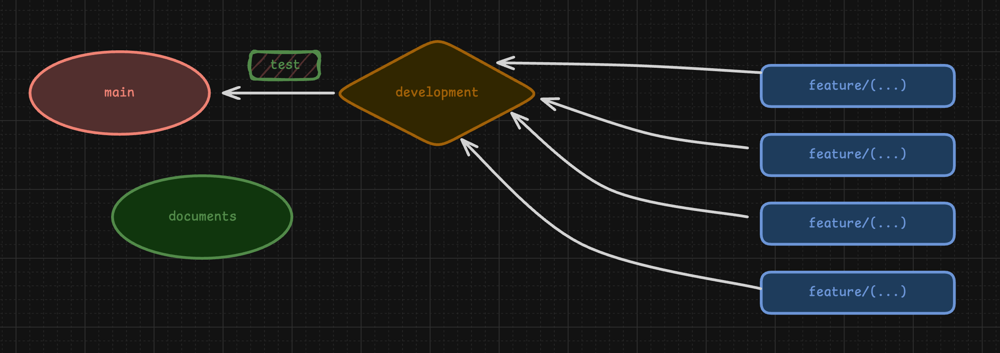

## Get Started

### Client Side

First, set up the environment variables,

```bash
cd client
cat <<EOL > .env.local
GOOGLE_GENERATIVE_AI_API_KEY=***
TMDB_API_KEY=***
TMDB_API_LONG_KEY=***
EOL
```

Then, install dependency and run developemnt enviroment,

```bash
npm install
npm run dev
```

### Server Side

Open a new terminal on the root of NL1C

```bash
cd server
python3 -m venv .venv
source .venv/bin/activate
pip install -r requirements.txt
```

Then, rename '.env.example' to '.env' and fill in your MongoDB URI, JWT secret, etc. And run,

```bash
python3 -m uvicorn src.main:app --reload
```

Read more in [Server README](./server/README.md).

## Git Repository Branch Overview



## Project Overview

### For Milestone

1. AI Recommendations (AI ChatBot)
2. _(static)_ Authentication `/login`, `/signup`
3. Movie detail `/movieDesc/abc`
   - _(static)_ review & rating
   - watch trailer
4. _(static)_ Watchlist `/watchlist`
5. Theme Switcher (Light / Dark mode)
6. Search movies
   - search bar
   - _(static)_ advance search `/discover`
7. _(static)_ User profile `/settings`
   - profile - reset password
     ...
